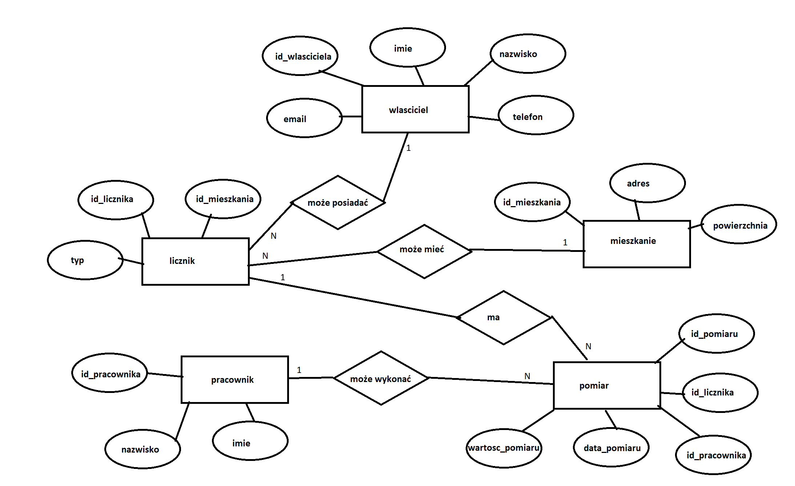
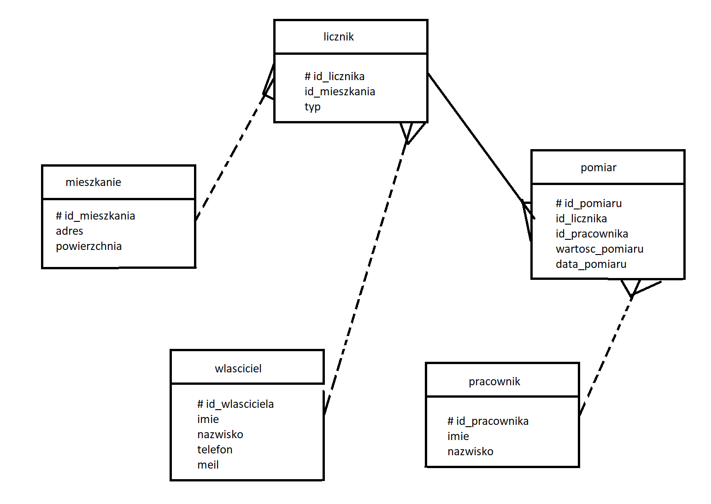

Opis zagadnienia
--------------------

Moja baza danych będzie dotyczyła odczytywania stanu licznika. Tabele znajdujące się w bazie danych to:

- mieszkanie: id_mieszkania INTEGER, adres (ulica, numer, kod pocztowy, miasto) TEXT, powierzchnia (INTEGER),

- wlasciciel: id_wlasciciela INTEGER, imię TEXT, nazwisko TEXT, telefon TEXT, email TEXT,

- licznik: id_licznika INTEGER, typ TEXT, id_mieszkania INTEGER,

- pomiar: id_pomiaru INTEGER, id_licznika INTEGER, wartosc_pomiaru INTEGER, data_pomiaru TIMESTAMP, id_pracownika INTEGER,

- pracownik: id_pracownika INTEGER, imię TEXT, nazwisko TEXT.

Procesy występujące w mojej bazie danych:

- Pracownik odwiedza mieszkanie i odczytuje wartość licznika (stan licznika).

- Pomiar jest zapisywany z datą i godziną.

- Dane są używane do rozliczenia mediów dla mieszkańców.

- Możemy śledzić historię pomiarów danego licznika.

Model koncepcyjny
------------------------

Na tym etapie zidentyfikujemy encje, zdefiniujemy atrybuty, opiszemy związki, określimy związki niepoprawne i zidentyfikujemy encje słabe. Model zostanie wykonany zgodnie z notacją Chena. 

**Encje w bazie danych**

Encje:
- mieszkanie — miejsce, gdzie jest licznik,

- wlasciciel — osoba powiązana z mieszkaniem/licznikiem,

- licznik — urządzenie mierzące zużycie mediów (woda, prąd itp.),

- pomiar — odczytany stan/liczba z licznika,

- pracownik — osoba dokonująca pomiaru lub aktualizacji danych.

**Atrybuty encji**

Atrybuty encji:
- mieszkanie: id_mieszkania, adres, powierzchnia,

- wlasciciel: id_wlasciciela, imie, nazwisko, telefon, email,

- licznik: id_licznika, typ, id_mieszkania,

- pomiar: id_pomiaru, id_licznika, wartosc_pomiaru, data_pomiaru, id_pracownika,

- pracownik: id_pracownika, imię, nazwisko.

**Opis relacji między encjami**

Relacje:
- mieszkanie - licznik: jeden lokal może mieć wiele liczników -> 1:N,

- wlasciciel - licznik: jeden właściciel może posiadać wiele liczników -> 1:N,

- licznik - pomiar: jeden licznik ma wiele pomiarów -> 1:N,

- pracownik - pomiar: jeden pracownik może wykonać wiele pomiarów -> 1:N.

**Relacje niepoprawne**

Relacje niepoprawne:
- Przypisywanie pomiarów do niewłaściwego licznika

- Pomiar bez przypisanego pracownika

- Licznik bez powiązanego mieszkania lub właściciela

**Encje słabe**

Można rozważyć Pomiar jako encję słabą, bo jej istnienie zależy od licznika (nie ma sensu pomiar bez licznika).

**Model w notacji Chena**

Model logiczny i normalizacja
---------------------------

Na tym etapie opiszemy model logiczny, korzystając z notacji Barkera i sprawdzimy normalizację. 

Tabela przedstawiająca encje, atrybuty, klucze obce i klucze główne:

 

 | Encja      |  Klucz główny   |  Klucze obce   |              Atrybuty |
 |---|---|---|---|
  |mieszkanie | id_mieszkania   |                            |  adres, powierzchnia|
 | wlasciciel  |id_wlasciciela |                             |  imie, nazwisko, telefon, meil|
 | licznik   |  id_licznika     |  id_mieszkania             |  typ|
|  pomiar     | id_pomiaru      |  id_licznika,id_pracownika  | wartosc_pomiaru, data_pomiaru|
|  pracownik |  id_pracownika    |                            | imie, nazwisko|

**Model w notacji Bakera**

**Proces normalizacji**

Etap 1 - 1NF (pierwsza postać normalna)

- Wszystkie atrybuty są atomowe, brak wielowartościowych atrybutów.

- Dane są w tableach z kluczami głównymi. 

- Przykładowo każdy pomiar ma jedną wartość, każda osoba ma pojedynczy numer telefonu itd.

Etap 2 - 2NF (druga postać normalna)

- Każdy atrybut zależy od całego klucza głównego (dla tabel z kluczami złożonymi).

- Tu klucze główne są pojedyncze, więc 2NF jest spełnione.

- Przykładowo w tabeli Pomiar atrybuty zależą od id_pomiaru (unikalnego).

Etap 3 - 3NF (trzecia postać normalna)

- Wszystkie atrybuty zależą bezpośrednio od klucza, a nie od innych atrybutów.

- Eliminujemy zależności przejściowe.

- Przykładowo telefon i email są atrybutami właściciela, a nie licznika.

Podsumowując, mój model jest w 3NF, brak mu nadmiarowości i zależności przejściowych. Dane rozdzielone na tabele odpowiadające encjom, co umożliwia łatwe modyfikacje i zapytania, minimalizując anomalie.

Model fizyczny
-------------

**Model fizyczny SQLite**

SQLite jest prostą bazą, bez rozbudowanych mechanizmów (np. brak zaawansowanych typów danych, brak schematów czy ról). Komendy których będziemy używali do tworzenia bazy danych:
- ``CREATE TABLE`` - do utworzenia tabeli,

- ``PRIMARY KEY AUTOINCREMENT`` - do utowrzenia klucza głównego,

- ``FOREIGN KEY ... REFERENCES`` - do klucza obcego.

**Model fizyczny PostgreSQL**

PostgreSQL oferuje więcej typów danych, indeksów, schematów, a także zaawansowane mechanizmy (np. ``SERIAL``, ``UUID``, constraints). Możemy wykorzystać typ ``SERIAL`` do automatycznego zwiększania kluczy, typ ``TIMESTAMPTZ`` dla daty z czasem i strefą. Komendy których będziemy używali do tworzenia bazy danych:

- ``CREATE TABLE`` - do utworzenia tabeli,

- ``SERIAL PRIMARY KEY`` - do klucza głównego,

- ``REFERENCES`` - do klucza obcego,

