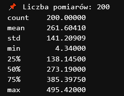

Funkcje podsumowujące bazę danych
--------------------------------------

Do podsumowania danych, użyłam takich bibliotek jak:

- pandas – pozwala wczytywać dane z bazy i je przetwarzać w wygodnej formie tabeli.

- matplotlib.pyplot – służy do tworzenia wykresów (liniowych, słupkowych, itd.).

Funkcja, która napisałam, pobiera dane z tabel(w moim przykładzie z tabeli pomiar), przetwarza dane i tworzy 2 różne wykresy. 

W podsumowaniu dostajemy zarówno statystyki tekstowe, jak i różne wykresy.  Funkcja wyświetla podstawowe statystyki kolumny wartosc_pomiaru, takie jak:

- count – ile jest wartości,

- mean – średnia,

- std – odchylenie standardowe,

- min – najmniejsza wartość,

- 25%, 50%, 75% – kwartyle,

- max – maksymalna wartość.

Pierwszy wykres dotyczy pomiarów wykonanych przez jednego pracownika. Dostajemy wykres liniowy, w którym na osi X zaznaczono daty pomiarów, a na osi Y wartość pomiaru. 

Drugim wykresem jest histogram w którym zostały przedstawione średnie wartości dla 5 wybranych liczników. 

Widzimy zatem, że do podsumowania naszej bazy danych, możemy użyć wielu dostępnych narzędzi. Podsumowanie możemy przedstawić za pomocą wykresów (liniowych, histogramu, kołowych itp.), a także słownie, przedstawiając najważniejsze statystyki. To co opisałam dla tabeli pomiar, możemy oczywiście zrobić dla pozostałych tabeli, podsumowując te informacje na których nam zależy. 

Wyszukiwanie bez znajomości SQLite
------------------------------

Każda funkcja korzysta z bazy SQLite i automatycznie wykonuje zapytania bez potrzeby znajomości SQL.

Moduł zawiera funkcje do wyszukiwania:
                                                   
-Pomiarów po nazwisku właściciela:

::
  
  import sqlite3
  import pandas as pd

  def connect(db_file='test.db'):
      return sqlite3.connect(db_file)

  def find_by_owner_lastname(nazwisko, db_file='test.db'):
      conn = connect(db_file)
      query = """
      SELECT wlasciciel.imie, wlasciciel.nazwisko, mieszkanie.adres, licznik.typ, pomiar.wartosc_pomiaru, pomiar.data_pomiaru
      FROM wlasciciel
      JOIN licznik ON wlasciciel.id_wlasciciela = licznik.id_mieszkania
      JOIN mieszkanie ON licznik.id_mieszkania = mieszkanie.id_mieszkania
      JOIN pomiar ON licznik.id_licznika = pomiar.id_licznika
      WHERE wlasciciel.nazwisko LIKE ?
      """
      df = pd.read_sql_query(query, conn, params=(f"%{nazwisko}%",))
      conn.close()
      return df

-Pomiarów po adresie mieszkania

::
  
  def find_by_address(adres_fragment, db_file='test.db'):
      conn = connect(db_file)
      query = """
      SELECT mieszkanie.adres, licznik.typ, pomiar.wartosc_pomiaru, pomiar.data_pomiaru
      FROM mieszkanie
      JOIN licznik ON mieszkanie.id_mieszkania = licznik.id_mieszkania
      JOIN pomiar ON licznik.id_licznika = pomiar.id_licznika
      WHERE mieszkanie.adres LIKE ?
      """
      df = pd.read_sql_query(query, conn, params=(f"%{adres_fragment}%",))
      conn.close()
      return df

-Pomiarów w zakresie dat

::

    def find_by_date_range(start_date, end_date, db_file='test.db'):
      conn = connect(db_file)
      query = """
      SELECT * FROM pomiar
      WHERE data_pomiaru BETWEEN ? AND ?
      """
      df = pd.read_sql_query(query, conn, params=(start_date, end_date))
      conn.close()
      return df

-Pomiarów wykonanych przez pracownika

::

    def find_by_worker(worker_id, db_file='test.db'):
      conn = connect(db_file)
      query = """
      SELECT pracownik.imie, pracownik.nazwisko, licznik.typ, pomiar.wartosc_pomiaru, pomiar.data_pomiaru
      FROM pracownik
      JOIN pomiar ON pracownik.id_pracownika = pomiar.id_pracownika
      JOIN licznik ON pomiar.id_licznika = licznik.id_licznika
      WHERE pracownik.id_pracownika = ?
      """
      df = pd.read_sql_query(query, conn, params=(worker_id,))
      conn.close()
      return df

-Pomiarów dla konkretnego licznika

::
                                                  
    def find_by_meter(meter_id, db_file='test.db'):
      conn = connect(db_file)
      query = """
      SELECT licznik.typ, mieszkanie.adres, pomiar.wartosc_pomiaru, pomiar.data_pomiaru
      FROM licznik
      JOIN mieszkanie ON licznik.id_mieszkania = mieszkanie.id_mieszkania
      JOIN pomiar ON licznik.id_licznika = pomiar.id_licznika
      WHERE licznik.id_licznika = ?
      """
      df = pd.read_sql_query(query, conn, params=(meter_id,))
      conn.close()
      return df

Dzięki tym funkcjom kazdy może wyszukać interesujące go informacje z bazy danych, nawet bez znajomości składni SQLite.

Migrowanie danych z SQLite do PostgreSQL
-------------------------------

Migracja wymaga dokładnego zaplanowania, szczególnie ze względu na różnice w typach danych i funkcjonalnościach między SQLite i PostgreSQL. Automatyczne narzędzia mogą pomóc, ale ręczna weryfikacja i testy są niezbędne.

Prace do wykonania przy migracji SQLite do PostgreSQL oraz odwrotnie:

1. Eksport danych

- SQLite: eksport do formatu CSV lub JSON z odpowiednią strukturą.
   
- PostgreSQL: eksport do CSV lub JSON za pomocą ``COPY`` lub narzędzi typu ``pg\_dump``.

2. Mapowanie typów danych

- SQLite ma luźniejszą typizację, PostgreSQL wymaga dokładniejszych typów.

- Konieczne jest dopasowanie typów: np. SQLite ``TEXT`` → PostgreSQL ``VARCHAR/TEXT``, ``INTEGER`` → ``INTEGER``, ``REAL`` → ``FLOAT/DOUBLE PRECISION``.

3. Utworzenie schematu bazy w docelowym systemie

- W PostgreSQL: tworzymy tabele z uwzględnieniem kluczy głównych, indeksów, typów danych, relacji i ograniczeń (constraints).
 
- W SQLite: schemat jest prostszy, ale należy zadbać o kompatybilność i możliwe uproszczenia.

4. Przeniesienie danych

- Import plików CSV/JSON do nowej bazy (np. w PostgreSQL ``COPY FROM`` lub za pomocą narzędzi w Pythonie).
  
- Weryfikacja integralności danych.

5. Dostosowanie kodu aplikacji

- Zmiana składni SQL (PostgreSQL ma rozbudowane możliwości, SQLite jest bardziej ograniczone).
  
- Obsługa transakcji, indeksów i specyficznych funkcji DB.

6. Testy poprawności działania i wydajności

- Sprawdzenie spójności danych, poprawności zapytań i wydajności.

7. Backup i rollback

- Utworzenie kopii zapasowych przed migracją.

Pomiar czasu wykonania zapytań i analiza wydajności w PostgreSQL
---------------------------------------

Pomiar czasu wykonania zapytań:
~~~~~~~~~~
                                                  
Można użyć w Pythonie modułu ``time`` lub ``timeit``, np.:

::
                                                  
      import time
      start = time.time()
      cursor.execute("SELECT * FROM Pomiar WHERE wartosc_pomiaru > 100")
      result = cursor.fetchall()
      end = time.time()
      print(f"Czas wykonania zapytania: {end - start:.4f} s")

Wykorzystanie EXPLAIN:
~~~~~~~~

- ``EXPLAIN`` pozwala zobaczyć plan wykonania zapytania przez PostgreSQL — jakie indeksy są używane, jak są łączone tabele itp.

- ``EXPLAIN ANALYZE`` wykonuje zapytanie i podaje rzeczywiste czasy wykonania.

- Na podstawie tych informacji można zoptymalizować indeksy lub zapytania.

Systematyczne opisywanie wydajności:
~~~~~~~~~~
                                                

- Monitorowanie czasów odpowiedzi zapytań w regularnych odstępach.

- Automatyczne zbieranie i analizowanie wyników ``EXPLAIN ANALYZE``.

- Tworzenie alertów, gdy zapytania przekroczą określony próg czasu.

- Dokumentowanie zmian i ich wpływu na wydajność.

Wnioski:
~~~~~~~~~~
                                                  
Regularny pomiar i analiza planów wykonania pozwalają szybko zidentyfikować wąskie gardła w bazie danych. Stosowanie indeksów, optymalizacja zapytań i analiza planów to klucz do dobrej wydajności.s
